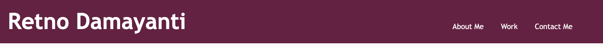
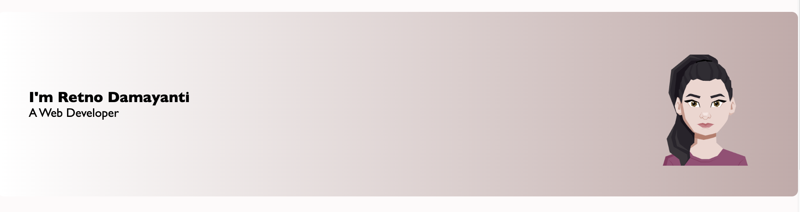
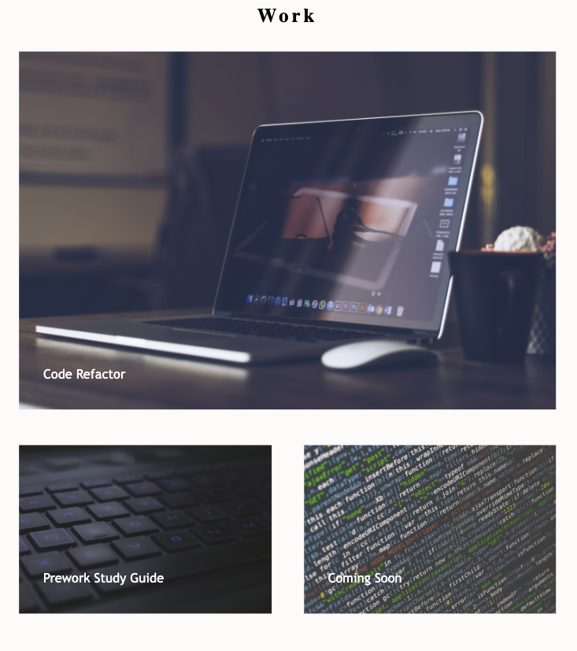
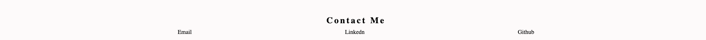

# Portfolio-Advanced-CSS
A portoflio page of Retno Damayanti.

## Description

This application was built to showcase a collection of my deployed webpage during Full Stack Web Developer Bootcamp. A potential employer is expected to have an overview of the qualification that I have and what I have achieved. Employers can contact me directly through the link in the application.

Through this application, I learned about how to showcase my work with responsive design and flexbox via CSS.

Please visit the application here: [Retno Damayanti's Portfolio](https://retnodamayanti.github.io/portfolio-css/)

## Installation

N/A

## Usage

- The header screenshot below shows developer name and navigation bar that will direct user to the section.

- The screnshot below shows an avatar and developer's name and role.

- The screnshot below shows a section of developer's applications.

- The screenshot below is a "Contact Me" section that has a list of option to reach out to the developer.
  

## License

Please refer to the LICENSE in the repo.